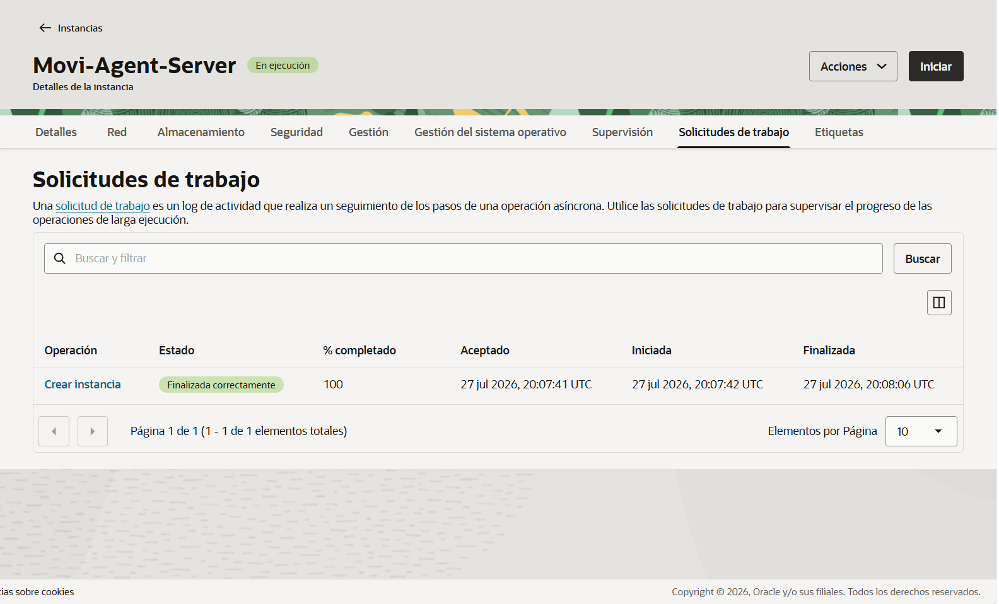

<div align="center">
  <h1>Movi</h1>
  <h3>Asistente Operativo de MoviTrack Py</h3>
  <br>
  
  <br>
  <h4>Tu IA aliada en la gestión operativa y administrativa.</h4>
</div>
<br>
---
<br>

## 📝 Descripción del Proyecto
Movi es un agente de inteligencia artificial diseñado para optimizar la gestión operativa y administrativa de MoviTrack Py. Este asistente actúa como una base de conocimiento centralizada para los empleados, permitiendo una resolución ágil de consultas técnicas, gestión de clientes y aplicación de políticas contractuales.
Movi está diseñado para estandarizar procesos críticos como la resolución de fallas técnicas, la verificación de estados de cuenta antes de asistencias de emergencia y la gestión de activos.

<div align="center">
  <h1>Movi</h1>
  <h3>Asistente Operativo de MoviTrack Py</h3>
  <br>
  
  <br>
  <h4>Tu IA aliada en la gestión operativa y administrativa.</h4>
</div>
<br>
---
<br>

## 📝 Descripción del Proyecto
Movi es un agente de inteligencia artificial diseñado para optimizar la gestión operativa y administrativa de MoviTrack Py. Este asistente actúa como una base de conocimiento centralizada para los empleados, permitiendo una resolución ágil de consultas técnicas, gestión de clientes y aplicación de políticas contractuales.
Movi está diseñado para estandarizar procesos críticos como la resolución de fallas técnicas, la verificación de estados de cuenta antes de asistencias de emergencia y la gestión de activos.

## 🏗️ Arquitectura
El agente utiliza una arquitectura RAG (Retrieval-Augmented Generation):
* **Ingesta:** Procesamiento de manuales técnicos (PDF), políticas de contratación (Word) y protocolos de asistencia (Markdown).
* **Orquestación:** n8n para la gestión de flujos de trabajo y lógica de consultas.
* **Inteligencia:** Google Gemini como LLM para el razonamiento operativo.
* **Infraestructura:** Despliegue en Oracle Cloud Infrastructure (OCI).

## 📂 Capacidades del Agente
Movi está capacitado para asistir a los colaboradores en:
* **Soporte Técnico:** Diagnóstico de dispositivos GPS con mal funcionamiento.
* **Gestión de Clientes:** Creación de usuarios nuevos y búsqueda rápida de vehículos mediante número de chapa.
* **Búsqueda Administrativa:** Localización de clientes por número de cédula.
* **Políticas de Recuperación:** Aplicación de protocolos para la recuperación de equipos por morosidad o finalización de servicio.
* **Protocolos de Asistencia:** Verificación obligatoria de estado de cuenta para asistencia en casos de robo.

## 🖥️ Interfaz del Agente
Movi cuenta con una interfaz de chat web intuitiva, optimizada para facilitar la consulta rápida de estados de cuenta y procedimientos técnicos, garantizando una lectura ágil para el colaborador.

## ⚙️ Mantenimiento y Evolución
* **Sincronización en tiempo real:** Movi opera conectado a la fuente maestra (Google Sheets).
* **Ciclo de mejora continua:** Monitoreo periódico de consultas para actualizar la base de conocimientos.
* **Curaduría de datos:** Auditoría constante de la veracidad de los datos cargados.

## ☁️ Despliegue en OCI

## 1. Introducción
Este repositorio documenta el proceso de despliegue y configuración de nuestra infraestructura en la nube utilizando Oracle Cloud Infrastructure (OCI) para el servidor **Movi-Agent-Server**.

## 2. Creación de la Instancia en OCI
Se configuró una máquina virtual basada en la capa gratuita de Oracle Cloud, utilizando una unidad compatible con el sistema operativo y asegurando los parámetros de red y almacenamiento correspondientes.

### Evidencia de Ejecución Exitosa:


## 3. Configuración de Acceso y Red
- **Dirección IP Pública:** `146.181.37.156`
- **Método de Conexión:** Acceso mediante par de claves SSH (generadas durante el aprovisionamiento de la instancia).
- **Puertos habilitados:** Configurados en la VCN para permitir el tráfico necesario para el servicio.

## 4. Conclusión
El servidor se encuentra operando correctamente en el entorno de OCI, listo para dar soporte al proyecto y recibir las configuraciones e implementaciones técnicas requeridas.

La arquitectura técnica para el despliegue del agente Movi en Oracle Cloud Infrastructure (OCI) ha sido diseñada considerando:
* **Compute:** Instancias VM.Standard.E2.1.Micro.
* **Almacenamiento:** OCI Object Storage con políticas IAM.
* **Seguridad:** VCN y Network Security Groups.

## 8. Registro de Ejecución

Para garantizar la trazabilidad de las operaciones, el sistema registra cada consulta en formato JSON, permitiendo auditar la atención al cliente en tiempo real:

```json
{
  "timestamp": "2026-07-19T14:15:00Z",
  "empleado_id": "EMP-085",
  "query": "¿Cuál es el estado de pago del cliente?",
  "resultado": "Verificación de base de datos completada",
  "latency_ms": 320
}

##🛠️ Tecnologías Utilizadas
Lenguaje: Python

Orquestador: n8n

IA: Google Gemini API

Nube: Oracle Cloud Infrastructure (OCI)

Control de Versiones: GitHub

## Evidencia de Ejecución

Evidencias de Funcionamiento:

1. Interfaz del Asistente: El inicio del chat donde el colaborador interactúa con Movi.

2. Consulta de Cliente al Día: Movi identifica al cliente, verifica su pago y devuelve sus datos de contacto de forma estructurada.

3. Reporte de Morosidad (Pendientes de pago): Movi filtra y lista automáticamente a los clientes que tienen pagos pendientes, facilitando la gestión de cobranzas.

## Evidencia 1: Interfaz de consulta**
  

* **Evidencia 2: Respuesta del asistente con datos técnicos**
  

* **Evidencia 3: Registro de logs (trazabilidad)**
  


